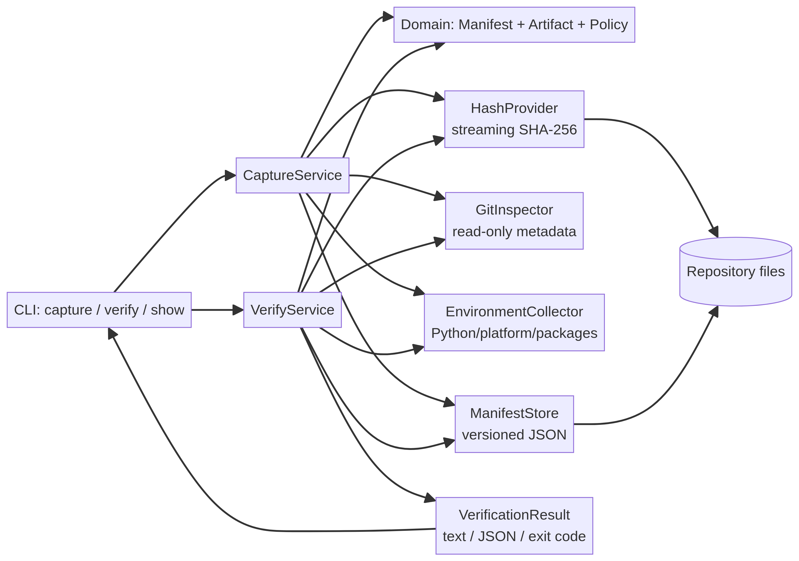

# ML ProofLedger

**Portable, verifiable evidence manifests for machine-learning runs.**

ML ProofLedger is a local-first Python CLI that captures the evidence surrounding an ML execution and verifies it later without a tracking server. It records declared input and output artifacts, streaming SHA-256 hashes, source revision, runtime metadata, parameters, metrics, and dataset split information in a versioned JSON manifest. A verifier re-hashes the current checkout and fails closed when evidence no longer matches.

> **Core idea:** a model file is not a reproducibility record. ProofLedger makes the surrounding evidence explicit, inspectable, and testable.

## Why this project exists

MLflow offers broad experiment tracking [1]. DVC focuses on versioning data and models and connecting them to experiment workflows [2]. OpenLineage models lineage events for jobs and datasets [3]. GitHub Artifact Attestations and SLSA address build provenance and attestations [4] [5]. These are valuable systems, but a small repository still needs a portable, commit-friendly evidence contract that can be reviewed and verified offline. ProofLedger focuses on that narrow gap rather than pretending to replace the platforms above.

The project was selected after an account audit, competitor review, and a weighted comparison of candidate ideas. The decision record is in [`docs/idea_selection.md`](docs/idea_selection.md), while the external research notes are in [`docs/research_notes.md`](docs/research_notes.md).

## What the MVP does

| Capability | Implementation |
|---|---|
| Capture | `proofledger capture` writes schema version `1.0` JSON evidence |
| Artifact integrity | Streaming SHA-256 for files; deterministic path-plus-digest hashing for directories |
| Execution context | Command metadata, UTC timestamp, Git revision/branch/dirty state, Python/platform, optional package versions |
| ML context | Parameters, numeric metrics, explicit dataset split counts, named inputs and outputs |
| Verification | `proofledger verify` checks schema, paths, kind, digest, size, file count, Git policy, and Python major/minor compatibility |
| CI integration | Stable exit codes and `--json` verification output |
| Safety | No shell execution, no network calls, no secret collection, no path traversal, symlinks rejected |
| Example | Deterministic nearest-centroid training run with a tiny CSV fixture |

## Quickstart

```bash
git clone https://github.com/ateeqdesktop-dot/ml-proofledger.git
cd ml-proofledger
python3 -m venv .venv
. .venv/bin/activate
python -m pip install -e ".[dev]"
make test
```

Run the deterministic example and capture its evidence:

```bash
make sample
make capture
make verify
```

The capture command creates `examples/proofledger.json`. The generated model and prediction files are ignored by Git because they are reproducible build outputs. To inspect the evidence without verifying it:

```bash
proofledger show --manifest examples/proofledger.json
proofledger show --manifest examples/proofledger.json --json
```

### Docker

The CLI can also be packaged as a small Python container:

```bash
docker build -t ml-proofledger .
docker run --rm ml-proofledger --help
```

To verify a checkout from the container, mount the repository and use an absolute root:

```bash
docker run --rm \\
  -v "$PWD":/workspace \\
  -w /workspace \\
  ml-proofledger verify --root /workspace --manifest /workspace/run-evidence.json --json
```

The Dockerfile is intentionally dependency-light. A Docker daemon is required to execute these commands; the Python and GitHub Actions paths remain the primary reproducible validation paths.

A minimal custom capture looks like this:

```bash
proofledger capture \
  --root . \
  --manifest run-evidence.json \
  --command python train.py --epochs 10 \
  --input dataset=data/train.csv \
  --output model=models/model.bin \
  --parameter seed=7 \
  --metric accuracy=0.91 \
  --split '{"name":"v1","strategy":"temporal","seed":7,"counts":{"train":800,"test":200}}'

proofledger verify --root . --manifest run-evidence.json --json
```

## Verification semantics

A successful result means that every declared evidence check passed under the policy stored in the manifest. It does **not** claim that the model is scientifically correct, that the original author was trustworthy, or that a training run is bit-for-bit reproducible across all hardware and libraries.

| Exit code | Meaning |
|---:|---|
| `0` | Capture succeeded or verification passed |
| `1` | Verification completed but evidence mismatched |
| `2` | Invalid input, malformed manifest, or filesystem/CLI error |

Failure records use stable codes such as `ARTIFACT_HASH_MISMATCH`, `MISSING_OR_UNREADABLE_PATH`, `GIT_REVISION_MISMATCH`, `GIT_WORKTREE_DIRTY`, and `PYTHON_VERSION_MISMATCH`. The JSON form is designed for CI and downstream tooling.

## Architecture

The repository uses a small layered design. Domain models define the manifest contract. Infrastructure adapters collect hashes, Git metadata, runtime metadata, and JSON storage. Application services orchestrate capture and verification. The CLI is a thin interface over those services.



The source diagram is [`docs/architecture.mmd`](docs/architecture.mmd), and the detailed design is [`docs/design.md`](docs/design.md).

## Security and threat model

ProofLedger treats manifest contents and repository files as untrusted input. Declared paths are resolved against the selected repository root and rejected if they escape it. Symlinks are rejected to avoid surprising target substitution. Git is invoked with fixed read-only argument lists; the recorded command is metadata and is never executed. Environment collection is intentionally narrow and does not copy arbitrary environment variables, tokens, or secret files.

Hash verification detects byte changes, missing paths, type changes, and directory membership/content changes. It cannot detect a malicious actor who controls both the artifact and the manifest, and it is not a replacement for signing. Signed manifests and GitHub/SLSA binding are roadmap items.

## Development

```bash
make test
make lint
make format-check
```

The test suite covers deterministic file and directory hashes, path traversal and symlink rejection, capture/store/verify success, tampered and missing artifacts, CLI JSON output, and invalid input. GitHub Actions runs tests, type checking, formatting, package build, and repository-hygiene checks on Python 3.10, 3.11, and 3.12.

Read [`CONTRIBUTING.md`](CONTRIBUTING.md) before opening a pull request and [`SECURITY.md`](SECURITY.md) for vulnerability reporting.

## Roadmap

The next useful increments are signed manifests, SARIF output, a reusable GitHub Action wrapper, dataset adapter plugins, optional OpenLineage export, and a remote evidence registry. These are intentionally outside the MVP so the current implementation stays auditable and dependency-light.

## License

MIT. See [`LICENSE`](LICENSE).

## References

[1]: https://mlflow.org/docs/latest/ml/tracking/ "MLflow Tracking"
[2]: https://doc.dvc.org/start "DVC documentation"
[3]: https://openlineage.io/docs/spec/object-model/ "OpenLineage object model"
[4]: https://docs.github.com/en/actions/concepts/security/artifact-attestations "GitHub Artifact Attestations"
[5]: https://slsa.dev/spec/v1.0/provenance "SLSA provenance"
